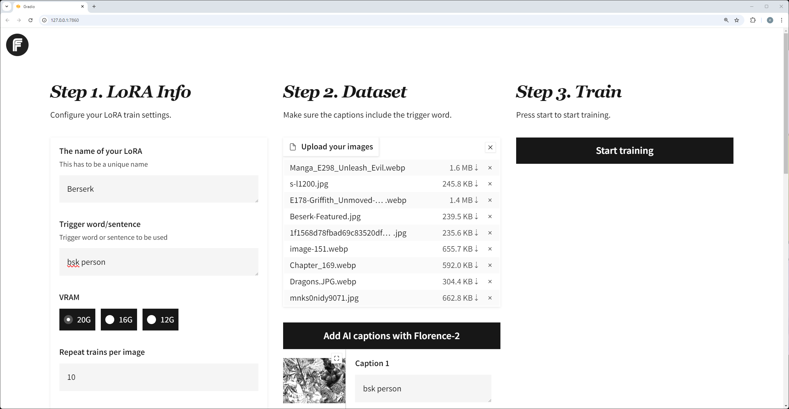
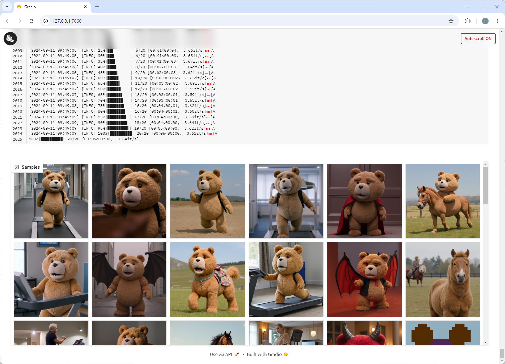
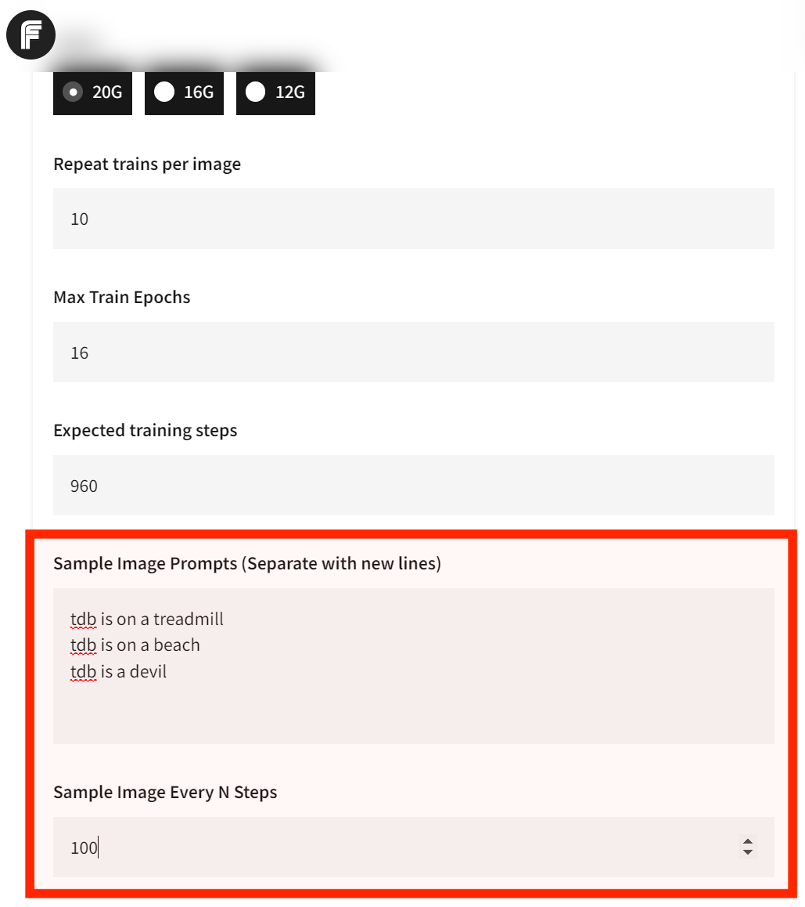
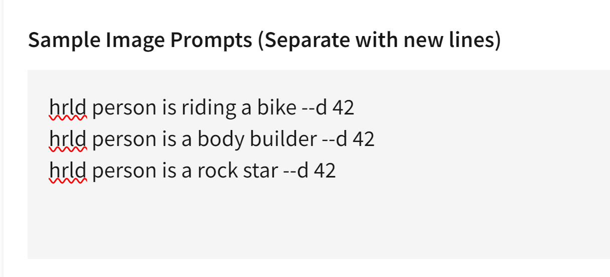
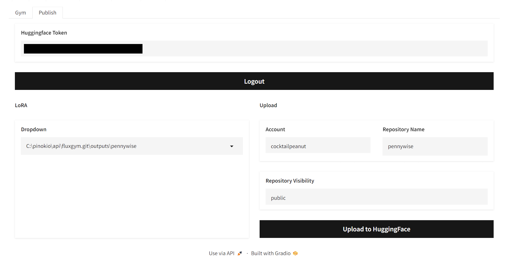
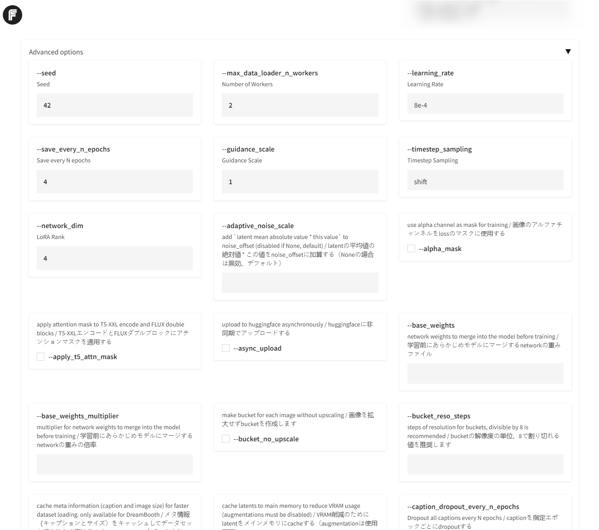

# FluxGym Hardened

**Production-ready FLUX LoRA training** with comprehensive improvements for stability, monitoring, and cloud deployment.

Based on the original [FluxGym](https://github.com/cocktailpeanut/fluxgym) by [@cocktailpeanut](https://x.com/cocktailpeanut), this hardened version adds:

- ✅ **Hang Prevention** - Timeout fixes for DataLoader, block swap, and file I/O
- ✅ **Automatic Monitoring** - Detects stuck training (GPU=0%) and auto-kills processes
- ✅ **State Persistence** - UI survives disconnects and page refreshes
- ✅ **Training Log Persistence** - View progress after reconnection
- ✅ **Success Verification** - Prevents false positive completions
- ✅ **Cloud-Ready** - All processes survive SSH disconnects
- ✅ **VS Code Server** - Browser-based editor (Runpod template)

**Repository:** https://github.com/jaysep/fluxgymHardened



---

# What is FluxGym Hardened?

**FluxGym** provides a simple web UI for training FLUX LoRA with **LOW VRAM (12GB/16GB/20GB) support**.

- **Frontend:** WebUI forked from [AI-Toolkit](https://github.com/ostris/ai-toolkit) (Gradio UI by [@multimodalart](https://x.com/multimodalart))
- **Backend:** Training powered by [Kohya sd-scripts](https://github.com/kohya-ss/sd-scripts)
- **Improvements:** Production-ready fixes and monitoring (this repository)

**FluxGym Hardened** adds comprehensive improvements to make FluxGym production-ready for cloud environments like Runpod, Vast.ai, and Lambda Labs.

---

# What's New in Hardened Version

## Core Improvements

### 🛡️ Hang Prevention
- **Disabled `blocks_to_swap`** - Eliminates critical CUDA deadlock
- **DataLoader timeout** (60s) - Prevents worker process hangs
- **Block swap timeout** (30s) - Avoids indefinite CUDA operations
- **File I/O timeout** (30s) - Prevents filesystem blocking
- **Result:** Training fails fast instead of hanging indefinitely

### 📊 Automatic Monitoring
- **GPU usage tracking** - Monitors every 30 seconds
- **Stuck detection** - Identifies GPU < 5% for 5+ minutes
- **Auto-kill** - Terminates stuck processes automatically
- **Checkpoint logging** - Records last checkpoint path for resume
- **Result:** Saves money by not wasting hours on hung training

### 💾 State Persistence
- **UI configuration auto-save** - All settings saved to JSON
- **Active sessions display** - See all recent/running trainings
- **Status tracking** - Clear indicators (🟢 Running / ✅ Completed / ❌ Failed / 🔵 Stopped)
- **Survives disconnects** - Refresh page, everything restored
- **Result:** Never lose progress due to connection issues

### 📝 Training Log Persistence
- **Dual logging** - Streaming (real-time) + file-based (persistent)
- **Auto-refresh** - Updates every 5 seconds
- **Last 100 lines** - Tail display for quick status check
- **Success markers** - Clear ✅/❌ indicators in logs
- **Result:** View training progress after any disconnect

### ✅ Success Verification
- **Model file check** - Verifies .safetensors exists
- **Exception handling** - Catches all training errors
- **Clear status** - No false positives (completed vs failed)
- **UI indicators** - Visual feedback (✅/❌)
- **Gradio notifications** - Popup alerts on completion/failure
- **Result:** Know exactly if training succeeded or failed

### ☁️ Cloud-Ready Processes
- **Process detachment** - Uses `start_new_session=True`
- **nohup compatible** - Survives terminal closures
- **PID tracking** - Manage processes across reconnections
- **SSH resilient** - Disconnects don't kill training
- **Result:** Train on cloud GPUs without constant monitoring

## Runpod Template Features

### 🖥️ VS Code Server Integration
- **Browser-based editor** - Full VS Code in browser (port 8888)
- **No password** - Convenient access via Runpod proxy
- **Full workspace access** - Edit all files in /workspace
- **Integrated terminal** - Run commands without SSH
- **Git integration** - Commit and push from browser
- **Result:** Edit, debug, and monitor—all in browser

### 📦 One-Click Deployment
- **Auto-install** - Complete setup in ~65 seconds
- **GitHub integration** - Pulls latest code automatically
- **Persistent updates** - `git pull` on each pod start
- **Model auto-download** - FLUX, CLIP, T5XXL cached
- **Result:** Deploy and train in under 2 minutes

---

# Quick Start

## Cloud Deployment (Recommended)

### Runpod Template (Easiest)

**1. Create Template** (one-time setup):
- Go to: https://www.runpod.io/console/user/templates
- Click "New Template"
- Copy settings from [`RUNPOD_TEMPLATE_FOR_JAYSEP.md`](RUNPOD_TEMPLATE_FOR_JAYSEP.md)
- Save template

**2. Deploy Pod**:
- Select "FluxGym Hardened" template
- Choose GPU (24GB recommended: RTX 4090, A5000, A6000)
- Deploy on-demand
- Wait ~1 minute for automatic setup

**3. Access Services**:
- **FluxGym UI**: Connect → HTTP Service [Port 7860]
- **VS Code**: Connect → HTTP Service [Port 8888]

**4. Start Training**:
- Upload images (12-20 recommended)
- Set LoRA name and concept sentence
- ✅ Enable Checkpointing (ON by default)
- ✅ Enable Auto-Monitoring (ON by default)
- Click "Start training"

**That's it!** All improvements active automatically.

### Manual Cloud Setup

```bash
# SSH to cloud GPU instance
ssh root@<instance-ip>

# Install dependencies
pip install -q gradio_logsview@https://huggingface.co/spaces/cocktailpeanut/gradio_logsview/resolve/main/gradio_logsview-0.0.17-py3-none-any.whl python-slugify peft lycoris-lora toml

# Clone FluxGym Hardened
cd /workspace
git clone https://github.com/jaysep/fluxgymHardened.git fluxgym
cd fluxgym

# Start FluxGym (cloud-ready with nohup)
nohup python app.py > fluxgym.log 2>&1 &
echo $! > fluxgym.pid

# Access at http://<instance-ip>:7860
```

## Local Installation

See [original FluxGym installation instructions](#install) below.

---

# Documentation

All guides included in this repository:

## Quick Starts
- [`README_COMPLETE_UPDATE.md`](README_COMPLETE_UPDATE.md) - Complete overview
- [`QUICK_START_CLOUD.md`](QUICK_START_CLOUD.md) - 30-second cloud setup
- [`QUICK_RECOVERY_GUIDE.md`](QUICK_RECOVERY_GUIDE.md) - Emergency recovery
- [`QUICK_REFERENCE.md`](QUICK_REFERENCE.md) - Fast reference guide

## Runpod Deployment
- [`RUNPOD_TEMPLATE_FOR_JAYSEP.md`](RUNPOD_TEMPLATE_FOR_JAYSEP.md) - **Complete template configuration** (USE THIS!)
- [`RUNPOD_TEMPLATE_CREATION.md`](RUNPOD_TEMPLATE_CREATION.md) - Template creation guide
- [`RUNPOD_MINIMAL_DEPLOYMENT.md`](RUNPOD_MINIMAL_DEPLOYMENT.md) - Skip 6GB containers (64MB deployment)
- [`VS_CODE_INTEGRATION.md`](VS_CODE_INTEGRATION.md) - VS Code Server guide

## Features
- [`STATE_PERSISTENCE_GUIDE.md`](STATE_PERSISTENCE_GUIDE.md) - How UI state works
- [`CHECKPOINT_RESUME_GUIDE.md`](CHECKPOINT_RESUME_GUIDE.md) - Checkpoint system
- [`TRAINING_LOG_PERSISTENCE.md`](TRAINING_LOG_PERSISTENCE.md) - Log persistence
- [`TRAINING_SUCCESS_VERIFICATION.md`](TRAINING_SUCCESS_VERIFICATION.md) - Success detection
- [`CLOUD_DEPLOYMENT_GUIDE.md`](CLOUD_DEPLOYMENT_GUIDE.md) - Complete cloud guide

## Technical
- [`SD_SCRIPTS_HANG_ANALYSIS.md`](SD_SCRIPTS_HANG_ANALYSIS.md) - Root cause analysis of hangs
- [`HANG_FIXES_IMPLEMENTED.md`](HANG_FIXES_IMPLEMENTED.md) - All fixes explained
- [`HUGGINGFACE_TOKEN_EXPLAINED.md`](HUGGINGFACE_TOKEN_EXPLAINED.md) - When you need HF token
- [`FINAL_UPDATE_SUMMARY.md`](FINAL_UPDATE_SUMMARY.md) - Complete changelog
- [`VSCODE_UPDATE_SUMMARY.md`](VSCODE_UPDATE_SUMMARY.md) - VS Code integration details

---

# Key Features

## The Two Magic Checkboxes

```
✅ Enable Checkpointing (Save training state for resume)
✅ Enable Auto-Monitoring (Detect stuck training automatically)
```

**Both ON by default.** Just leave them checked and everything works automatically!

## What Happens Automatically

**When you click "Start training":**
1. Saves UI config to `outputs/<lora>/ui_state.json`
2. Starts monitor in background (detached process)
3. Creates checkpoints every 4 epochs
4. Monitor watches GPU every 30 seconds
5. If stuck (GPU=0% for 5min), kills processes and logs checkpoint
6. Everything survives SSH disconnect

**When you refresh the browser:**
1. Shows "🔄 Active Training Sessions" banner
2. Lists all recent/active trainings with status
3. All your settings preserved
4. Training log shows last 100 lines (auto-refreshes)

## File Structure

```
outputs/my-lora/
├── ui_state.json          # UI configuration (auto-saved)
├── training.log           # Training logs (persistent)
├── monitor.pid            # Monitor process ID
├── monitor.log            # Monitor activity log
├── my-lora-8-state/       # Checkpoint at epoch 8
├── my-lora.safetensors    # Final trained model
└── sample/                # Generated sample images
```

## Common Commands

```bash
# Check if FluxGym is running
ps -p $(cat fluxgym.pid)

# View FluxGym logs
tail -f fluxgym.log

# View training log
tail -f outputs/my-lora/training.log

# View monitor log
tail -f outputs/my-lora/monitor.log

# Check training status
cat outputs/my-lora/ui_state.json | grep status

# Find checkpoints
python find_checkpoint.py outputs/my-lora

# Stop everything (if needed)
kill $(cat fluxgym.pid)
kill $(cat outputs/my-lora/monitor.pid)
pkill -9 -f "flux_train_network"
```

---

# GPU Configurations

FluxGym Hardened supports multiple VRAM configurations with optimized settings:

### 12GB VRAM (Budget)
- **Config:** 12G
- **Optimizer:** Adafactor
- **Features:** split_mode enabled, train_blocks=single
- **Sampling:** Disabled (save VRAM)
- **GPUs:** RTX 3060 (12GB)

### 16GB VRAM (Recommended)
- **Config:** 16G
- **Optimizer:** Adafactor
- **Features:** Full training, sampling enabled
- **Best for:** RTX 4000, A4000
- **Sweet spot:** Balance of speed and features

### 20GB+ VRAM (Best)
- **Config:** 20G
- **Optimizer:** AdamW8bit
- **Features:** All features enabled, fastest training
- **Best for:** RTX 4090 (24GB), A5000 (24GB), A6000 (48GB), L40 (48GB)

---

# Recovery Scenarios

## Training Stuck (GPU = 0%)

**Auto-detected** by monitor after 5 minutes:
1. Monitor kills stuck processes
2. Logs checkpoint path to `outputs/<lora>/monitor.log`
3. Resume from checkpoint via UI

**Manual recovery:**
```bash
# Check monitor log for checkpoint path
tail outputs/my-lora/monitor.log

# Shows: "Latest checkpoint: outputs/my-lora/my-lora-8-state"

# In FluxGym UI:
# - Paste checkpoint path in "Resume from Checkpoint"
# - Click "Start training"
```

## Browser Disconnected

**Automatic recovery:**
1. Refresh browser
2. See "🔄 Active Training Sessions" banner
3. Shows 🟢 Running / ✅ Completed / ❌ Failed
4. Training log displays last 100 lines
5. All settings preserved

## SSH Disconnected

**Cloud-ready processes continue:**
1. Reconnect to cloud instance
2. Open FluxGym UI: `http://<ip>:7860`
3. See active sessions with status
4. Training and monitoring still running
5. Everything intact!

---

# Cost Optimization (Cloud)

## Runpod Example

**Training 16 epochs on RTX 4090:**
- **GPU:** RTX 4090 (24GB VRAM)
- **Rate:** $0.69/hour
- **Time:** ~2 hours
- **Cost:** ~$1.38 per LoRA

**With auto-monitoring:**
- Detects hangs within 5 minutes
- Kills stuck training automatically
- Saves money by not wasting hours on hung processes

**Network volume** (optional):
- **Cost:** $10/month (100GB)
- **Benefit:** Models persist (no re-download)
- **Break-even:** ~13 pod sessions/month
- **Recommendation:** Use ephemeral for occasional use, volume for regular use

---

# Troubleshooting

## Sessions Not Showing

```bash
# Check if state files exist
ls outputs/*/ui_state.json

# Verify valid JSON
cat outputs/my-lora/ui_state.json | jq .
```

## Monitor Not Running

```bash
# Get monitor PID
cat outputs/my-lora/monitor.pid

# Check if running
ps -p $(cat outputs/my-lora/monitor.pid)

# View monitor logs
tail -f outputs/my-lora/monitor.log
```

## State File Corrupted

```bash
# Delete and restart training
rm outputs/my-lora/ui_state.json

# Training will create new state file
```

## Training Shows Complete But No Model

**This is prevented!** Success verification checks:
- Model file exists (.safetensors)
- No exceptions during training
- Status set to "failed" if model missing

If you see ✅ Completed, the model is guaranteed to exist.

---

# Original FluxGym Features

Below are the original FluxGym features. All work with the hardened improvements!

# Supported Models

1. Flux1-dev
2. Flux1-dev2pro (as explained here: https://medium.com/@zhiwangshi28/why-flux-lora-so-hard-to-train-and-how-to-overcome-it-a0c70bc59eaf)
3. Flux1-schnell (Couldn't get high quality results, so not really recommended, but feel free to experiment with it)
4. More?

The models are automatically downloaded when you start training with the model selected.

You can easily add more to the supported models list by editing the [models.yaml](models.yaml) file.

---

# Install

## Recommended: Cloud Deployment

For cloud GPU instances (Runpod, Vast.ai, Lambda Labs), see the [Quick Start](#quick-start) section above for the easiest deployment method.

## Local Installation

### Method 1: Manual Install (Recommended for Local)

First clone FluxGym Hardened and kohya-ss/sd-scripts:

```bash
git clone https://github.com/jaysep/fluxgymHardened.git fluxgym
cd fluxgym
git clone -b sd3 https://github.com/kohya-ss/sd-scripts
```

Your folder structure will look like this:

```
/fluxgym
  app.py
  requirements.txt
  /sd-scripts
```

Now activate a venv from the root `fluxgym` folder:

If you're on Windows:

```
python -m venv env
env\Scripts\activate
```

If your're on Linux:

```
python -m venv env
source env/bin/activate
```

This will create an `env` folder right below the `fluxgym` folder:

```
/fluxgym
  app.py
  requirements.txt
  /sd-scripts
  /env
```

Now go to the `sd-scripts` folder and install dependencies to the activated environment:

```
cd sd-scripts
pip install -r requirements.txt
```

Now come back to the root folder and install the app dependencies:

```
cd ..
pip install -r requirements.txt
```

Finally, install pytorch Nightly:

```
pip install --pre torch torchvision torchaudio --index-url https://download.pytorch.org/whl/cu121
```

Or, in case of NVIDIA RTX 50-series (5090, etc.) you will need to install cu128 torch and update bitsandbytes to the latest:

```
pip install --pre torch torchvision torchaudio --index-url https://download.pytorch.org/whl/nightly/cu128
pip install -U bitsandbytes
```


### Start FluxGym

Go back to the root `fluxgym` folder, with the venv activated:

**For local use:**
```bash
python app.py
```

**For cloud use (survives disconnects):**
```bash
nohup python app.py > fluxgym.log 2>&1 &
echo $! > fluxgym.pid
```

> Make sure to have the venv activated before running `python app.py`.
>
> Windows: `env\Scripts\activate`
> Linux: `source env/bin/activate`

### Method 2: Docker Install

First clone FluxGym Hardened and kohya-ss/sd-scripts:

```bash
git clone https://github.com/jaysep/fluxgymHardened.git fluxgym
cd fluxgym
git clone -b sd3 https://github.com/kohya-ss/sd-scripts
```
Check your `user id` and `group id` and change it if it's not 1000 via `environment variables` of `PUID` and `PGID`. 
You can find out what these are in linux by running the following command: `id`

Now build the image and run it via `docker-compose`:
```
docker compose up -d --build
```

Open web browser and goto the IP address of the computer/VM: http://localhost:7860

# Usage

The usage is pretty straightforward:

1. Enter the lora info
2. Upload images and caption them (using the trigger word)
3. Click "start".

That's all!


# Configuration

## Sample Images

By default fluxgym doesn't generate any sample images during training.

You can however configure Fluxgym to automatically generate sample images for every N steps. Here's what it looks like:



To turn this on, just set the two fields:

1. **Sample Image Prompts:** These prompts will be used to automatically generate images during training. If you want multiple, separate teach prompt with new line.
2. **Sample Image Every N Steps:** If your "Expected training steps" is 960 and your "Sample Image Every N Steps" is 100, the images will be generated at step 100, 200, 300, 400, 500, 600, 700, 800, 900, for EACH prompt.



## Advanced Sample Images

Thanks to the built-in syntax from [kohya/sd-scripts](https://github.com/kohya-ss/sd-scripts?tab=readme-ov-file#sample-image-generation-during-training), you can control exactly how the sample images are generated during the training phase:

Let's say the trigger word is **hrld person.** Normally you would try sample prompts like:

```
hrld person is riding a bike
hrld person is a body builder
hrld person is a rock star
```

But for every prompt you can include **advanced flags** to fully control the image generation process. For example, the `--d` flag lets you specify the SEED.

Specifying a seed means every sample image will use that exact seed, which means you can literally see the LoRA evolve. Here's an example usage:

```
hrld person is riding a bike --d 42
hrld person is a body builder --d 42
hrld person is a rock star --d 42
```

Here's what it looks like in the UI:



And here are the results:


In addition to the `--d` flag, here are other flags you can use:


- `--n`: Negative prompt up to the next option.
- `--w`: Specifies the width of the generated image.
- `--h`: Specifies the height of the generated image.
- `--d`: Specifies the seed of the generated image.
- `--l`: Specifies the CFG scale of the generated image.
- `--s`: Specifies the number of steps in the generation.

The prompt weighting such as `( )` and `[ ]` also work. (Learn more about [Attention/Emphasis](https://github.com/AUTOMATIC1111/stable-diffusion-webui/wiki/Features#attentionemphasis))

## Publishing to Huggingface

1. Get your Huggingface Token from https://huggingface.co/settings/tokens
2. Enter the token in the "Huggingface Token" field and click "Login". This will save the token text in a local file named `HF_TOKEN` (All local and private).
3. Once you're logged in, you will be able to select a trained LoRA from the dropdown, edit the name if you want, and publish to Huggingface.




## Advanced

The advanced tab is automatically constructed by parsing the launch flags available to the latest version of [kohya sd-scripts](https://github.com/kohya-ss/sd-scripts). This means Fluxgym is a full fledged UI for using the Kohya script.

> By default the advanced tab is hidden. You can click the "advanced" accordion to expand it.




## Advanced Features

### Uploading Caption Files

You can also upload the caption files along with the image files. You just need to follow the convention:

1. Every caption file must be a `.txt` file.
2. Each caption file needs to have a corresponding image file that has the same name.
3. For example, if you have an image file named `img0.png`, the corresponding caption file must be `img0.txt`.

---

# Credits and Acknowledgments

## Original FluxGym

FluxGym Hardened is based on the excellent [FluxGym](https://github.com/cocktailpeanut/fluxgym) project by [@cocktailpeanut](https://x.com/cocktailpeanut).

**Original components:**
- Simple Gradio UI design
- Integration with Kohya sd-scripts
- Low VRAM support (12GB/16GB/20GB)
- Sample image generation
- Advanced features tab
- Huggingface publishing

## Technologies Used

### Backend Training
- **[Kohya sd-scripts](https://github.com/kohya-ss/sd-scripts)** - Powerful and flexible FLUX training scripts
- **[Accelerate](https://github.com/huggingface/accelerate)** - Distributed training and mixed precision
- **[PEFT](https://github.com/huggingface/peft)** - Parameter-Efficient Fine-Tuning (LoRA)
- **[LyCORIS](https://github.com/KohakuBlueleaf/LyCORIS)** - Advanced LoRA architectures

### Frontend UI
- **[Gradio](https://github.com/gradio-app/gradio)** - Web UI framework
- **[AI-Toolkit](https://github.com/ostris/ai-toolkit)** - Original UI inspiration by [@multimodalart](https://x.com/multimodalart)

### Models
- **[FLUX.1-dev](https://github.com/black-forest-labs/flux)** - Base diffusion model by Black Forest Labs
- **[CLIP](https://github.com/openai/CLIP)** - Text encoder
- **[T5-XXL](https://github.com/google-research/text-to-text-transfer-transformer)** - Text encoder

### Development Tools
- **[code-server](https://github.com/coder/code-server)** - VS Code in browser
- **PyTorch** - Deep learning framework
- **CUDA** - GPU acceleration

## Hardened Version Improvements

**Repository:** https://github.com/jaysep/fluxgymHardened

**Key contributions:**
- Hang prevention fixes (timeout mechanisms)
- Automatic GPU monitoring and stuck detection
- State persistence system
- Training log persistence
- Success verification
- Cloud-ready process management
- VS Code Server integration
- Comprehensive documentation (20+ guides)

## Community

**Original FluxGym:**
- GitHub: https://github.com/cocktailpeanut/fluxgym
- Creator: [@cocktailpeanut](https://x.com/cocktailpeanut)

**FluxGym Hardened:**
- GitHub: https://github.com/jaysep/fluxgymHardened
- Issues: https://github.com/jaysep/fluxgymHardened/issues

## License

FluxGym Hardened inherits the license from the original FluxGym project.

Training scripts (sd-scripts) are licensed under Apache 2.0 by Kohya.

---

# Support

## Documentation

All guides are included in this repository:
- 📘 Quick starts and tutorials
- 🚀 Runpod deployment guides
- 🔧 Technical analysis and fixes
- ❓ Troubleshooting and FAQs

See the [Documentation](#documentation) section above for the complete list.

## Issues

**For FluxGym Hardened issues:**
- GitHub Issues: https://github.com/jaysep/fluxgymHardened/issues

**For original FluxGym issues:**
- GitHub Issues: https://github.com/cocktailpeanut/fluxgym/issues

## Contributing

Improvements and bug fixes are welcome! Please submit pull requests to:
- https://github.com/jaysep/fluxgymHardened

---

**Happy Training!** 🚀

Train production-ready FLUX LoRAs with confidence:
- ✅ No hangs
- ✅ Auto-monitoring
- ✅ State persistence
- ✅ Cloud-ready
- ✅ Complete documentation

**All in one package!** 🎯
